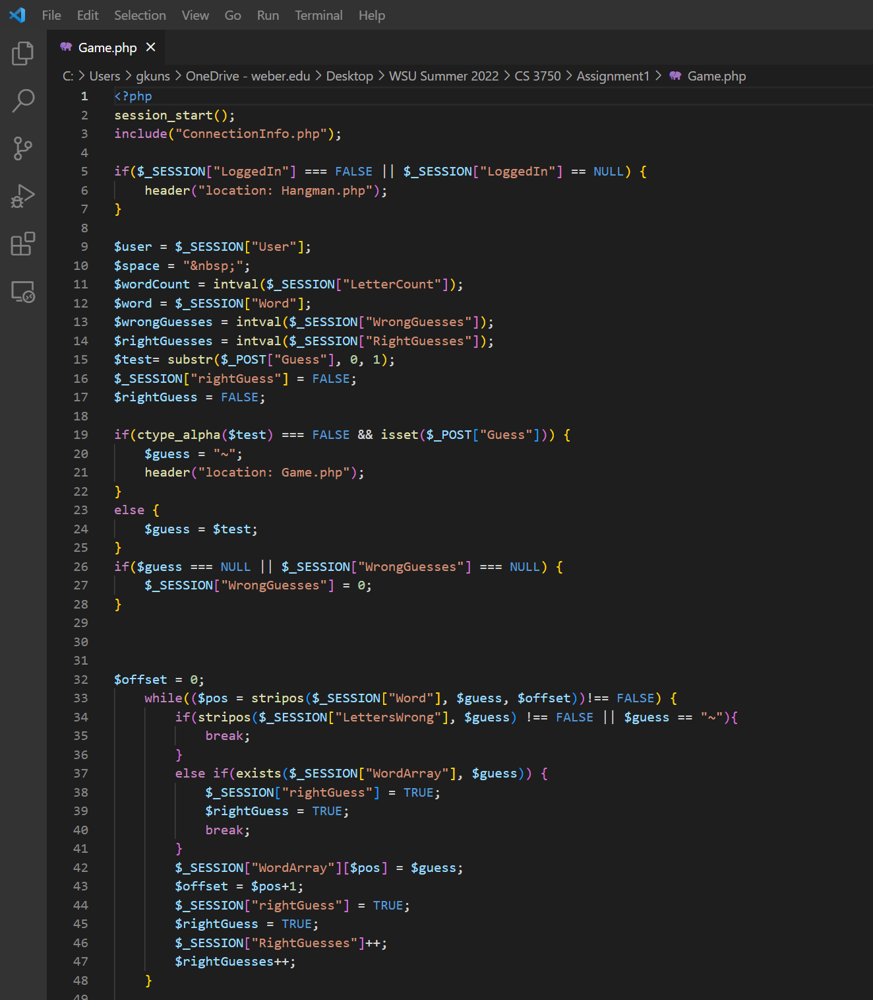
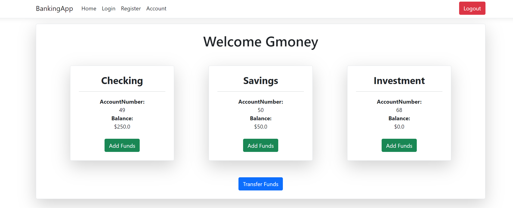
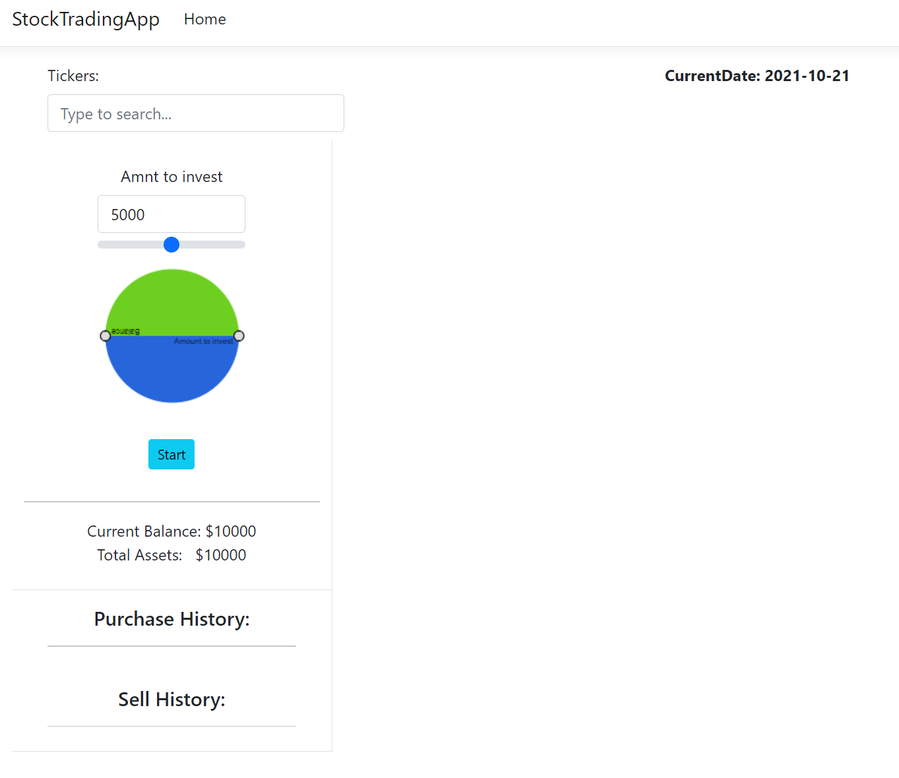
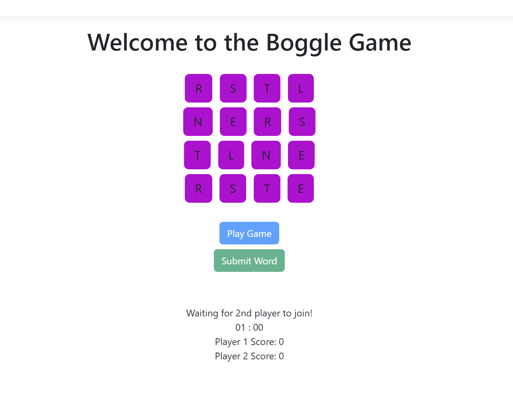

<html>
    <head>
        <link rel="stylesheet" href="https://cdn.jsdelivr.net/npm/bootstrap@4.3.1/dist/css/bootstrap.min.css" integrity="sha384-ggOyR0iXCbMQv3Xipma34MD+dH/1fQ784/j6cY/iJTQUOhcWr7x9JvoRxT2MZw1T" crossorigin="anonymous">
        <h1>Garrett Kuns Project Portfolio</h1>
        <h3>Portfolio overview of personal and course work projects</h3>
    </head>
    <body>
        
 Below is a list of projects with links to them that have been completed utilizing markdown languages like HTML and programming languages like PHP, C#, and .NET.

        

            

                

                    <h2>Hangman</h2>
                    
<a class="btn btn-secondary" href="https://github.com/GKarma5523/HangmanGame" role="button">View on Github</a>

                    
                    
Enjoy a digital game of Hangman

                    
<a class="btn btn-secondary" href="hangman.html" role="button">View Details</a>

                

                

                    <h2>Banking App</h2>
                    
<a class="btn btn-secondary" href="https://github.com/GKarma5523/BankingApp" role="button">View on Github</a>

                    
                    
A take on our own banking backend

                    
<a class="btn btn-secondary" href="hangman.html" role="button">View Details</a>

                

                

                    <h2>Stock Trading App</h2>
                    
<a class="btn btn-secondary" href="https://github.com/GKarma5523/StockTradingApp" role="button">View on Github</a>

                    
                    
Try your skills at the S&P 500 over the last year

                    
<a class="btn btn-secondary" href="https://gkarma5523.github.io/StockTradingApp/" role="button">View Details</a>

                

                

                    <h2>Boggle</h2>
                    
<a class="btn btn-secondary" href="" role="button">View on Github</a>

                    
                    
Compete against another to guess the most words
    
                    
<a class="btn btn-secondary" href="hangman.html" role="button">View Details</a>

                

            

        

    </body>
</html>
